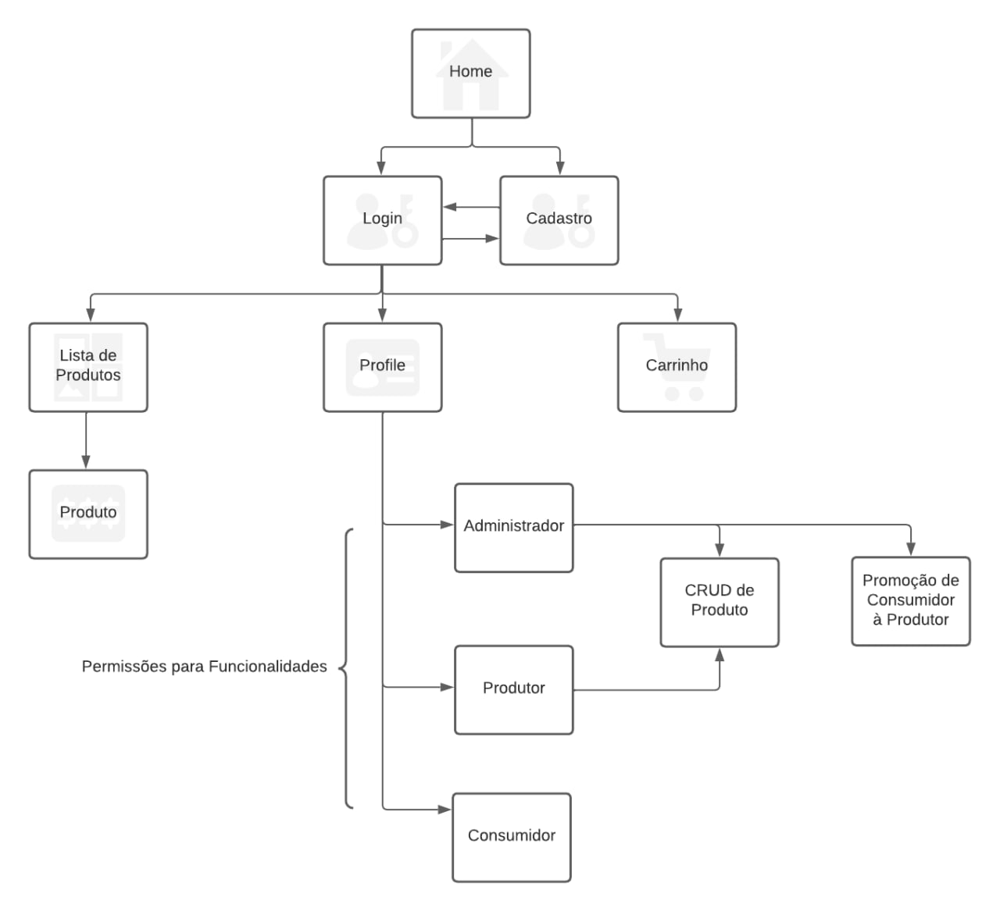

#  **Projeto-HortaUrbana**

Carlos Filipe de Castro Lemos (12542630)  
João Gabriel Sasseron Roberto Amorim (12542564)  
Pedro Guilherme dos Reis Teixeira (12542477)

## 1. **Requisitos**

* O sistema deve possuir 3 tipos de usuários:
    * Os **clientes** são usuários que acessam o sistema para comprar produtos/serviços. 
    * Os **Super Administradores** são responsáveis por registrar/gerenciar administradores, clientes e produtos/serviços fornecidos. O aplicativo já vem com uma conta de adminstração com senha admin.
    * Os **Administradores** são responsáveis por registrar/gerenciar os seus produtos dentro do *e-coommerce*. Os cargos de administradores adquiridos após uma avaliação do clientes e dado por via Super Adminstrador.
* Os registros dos Clientes inclui: **nome completo**, **id**, **telefone**, **email** e **endereço**. 
* Os registros dos serviços/produtos inclui: **nome**, **id**, **foto**, **descrição**, **preço**, **quantidade** (em estoque) e **quantidade vendida**.
* A loja deve vender produtos.
* Produtos vendidos: Os produtos são selecionados e sua quantidade escolhida é adicionada em um carrinho. Os produtos são comprados usando um número de cartão de cŕedito (qualquer número é aceito pelo sistema). A quantidade de produto vendido é subtraída da quantidade em estoque e adicionada à quantidade vendida. Carrinhos são esvaziados somente  após o pagamento ou pelos clientes.

## 2. **Descrição do Projeto**

## 3. **Comentários Sobre o Código**

## 4. **Plano de Teste**

## 5. **Resultados do Teste**

## 6. **Processos de Construção**

## 7. **Problemas**

## 8. **Comentários**