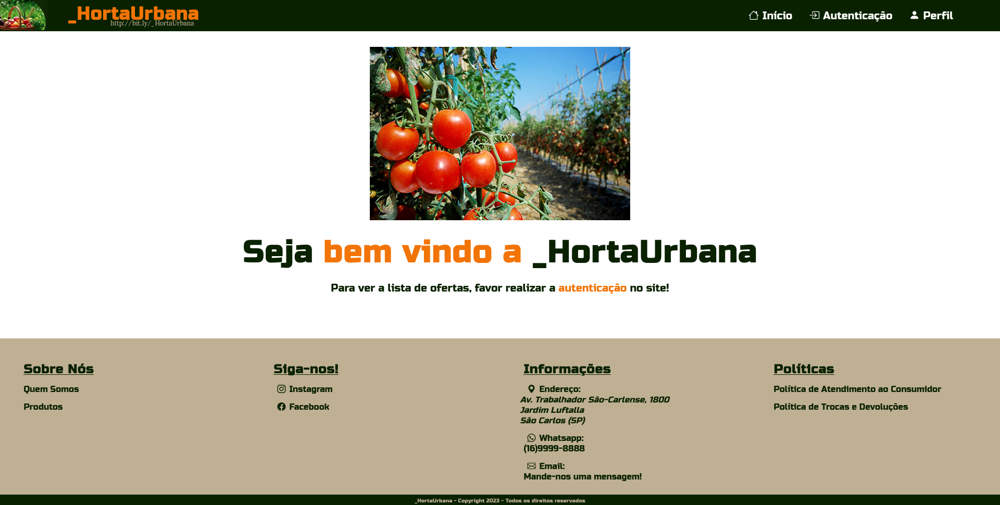

#  **Projeto-HortaUrbana**

Carlos Filipe de Castro Lemos (12542630)  
João Gabriel Sasseron Roberto Amorim (12542564)  
Pedro Guilherme dos Reis Teixeira (12542477)

## 1. **Requisitos**

* O sistema deve possuir 3 tipos de usuários:
    * Os **administrador** são responsáveis por registrar/gerenciar produtores, clientes e serviços fornecidos. O aplicativo já vem com uma conta de adminstração.
    * Os **clientes** são usuários que acessam o sistema para comprar produtos/serviços. 
    * Os **produtores** são responsáveis por registrar/gerenciar os seus produtos dentro do *e-coommerce*. Os cargos de produtores adquiridos após uma avaliação do cliente e dado por via Adminstrador.
  
* Os registros dos Clientes inclui: **nome completo**, **id**, **telefone**, **email** e **endereço**. 
* Os registros dos serviços/produtos inclui: **nome**, **id**, **foto**, **descrição**, **preço**, **quantidade** (em estoque) e **quantidade vendida**.
* A loja deve vender produtos.
* Produtos vendidos: Os produtos são selecionados e sua quantidade escolhida é adicionada em um carrinho. Os produtos são comprados usando um número de cartão de cŕedito (qualquer número é aceito pelo sistema). A quantidade de produto vendido é subtraída da quantidade em estoque e adicionada à quantidade vendida. Carrinhos são esvaziados somente  após o pagamento ou pelos clientes.

## 2. **Descrição do Projeto**

Chamado Horta Urbana o nosso projeto busca agir como uma loja digital com um filosofia similar a sites como a Amazon e iFood, porém com o diferencial de se aplicar ao escopo especializado de produtos que um consumidor encontraria usualmente em uma feira fisíca, como vegetais e verduras. O próposito é que certos usuários(Clientes) possam obter a classificação de vendedor(Administrador) e oferecer seus diversos produtos, outros usuários (Que podem também ser outros Administradores) poderiam então selecionar os items que mais atraem sua atenção e os colocar no carrinho de compras. 

### 2.1 **Home**

A primeira página que um indivíduo vê ao acessar o link do site, sua função principal e guiar usuários para as telas de cadastro e/ou login mas também permite o acesso direto do perfil de um usuário caso o mesmo ja esteja logado. Ela está desenvolvida em html e css.

### 2.2 **Login**

Essa página primeiro apresenta que o cabeçalho e e rodapé vista na página "Home" será mantida como padrão em todas as outras. Ela apresenta um formulário simples onde são requisitados o e-mail e senha de um usuário ja cadastrado para que ele possa acessar o site em seu perfil. Ela está desenvolvida em html e css.

### 2.3 **Cadastro**

Apresenta o formulário de cadastro de um indivíduo, requisitando seu nome, endereço, telefone e informações de login. O endereço pode parecer não intuitivo como uma informação de cadastro porém assume-se que: Um usuário base (Cliente) necessitaria de tal informação para receber seus produtos por entrega, como todos os usuários que vendem produtos (Administradores) também são Clientes essa necessidade se extende a eles. Ela está desenvolvida em html e css.

### 2.4 **Lista de Produtos**

A página onde produtos são pesquisados e accesados, na imagem um exemplo base é usado para mostrar quais categorias de dados o produto apresentaria. A imagem apresenta a página da perspectiva de um Super Administrador que poderia deletar e editar quaisquer produtos no site, um Administrador pelo o outro lado poderia faze-lo apenas para seus próprios produtos enquanto um Cliente é capaz apenas de visualizar e acessar produtos.

### 2.5 **Profile**

Pão -> Descrição Específicas

### 2.6 **Carinho**

Pão -> Descrição Específicas

### 2.7 **CRUD de Produto**

Pão -> Descrição Específicas

### 2.8 **Promoção de Consumidor à Produtor**
Pão -> Descrição Específicas

## 3. **Comentários Sobre o Código**

## 4. **Plano de Teste**

## 5. **Resultados do Teste**

## 6. **Processos de Construção**

## 7. **Problemas**

## 8. **Comentários**

