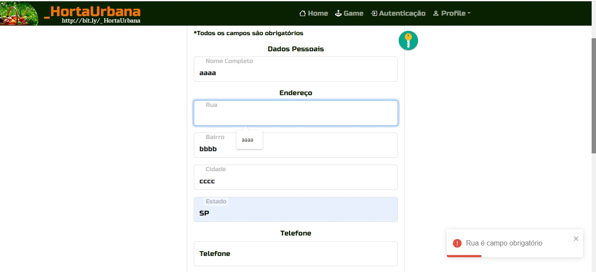

#  **Projeto-HortaUrbana**

Carlos Filipe de Castro Lemos (12542630)  
João Gabriel Sasseron Roberto Amorim (12542564)  
Pedro Guilherme dos Reis Teixeira (12542477)

## 1. **Requisitos: Pessoas e Papéis**

* O sistema deve possuir 3 tipos de usuários:

    * _**Administrador**_: trata-se de um perfil único que é um super usuário do sistema, afinal é responsável pelo gerenciamento de produtores, clientes e dos produtos do website. O aplicativo já vem com uma conta de administração (usuário: admin@admin.com e senha: 123456 - a qual ainda não foi implementada).

    * _**Clientes**_: são usuários que acessam o website para fazer compras de produtos. É necessário que realizem o cadastro no sistema para comprar produtos dos produtores. 

    * _**Produtores**_: inicialmente se cadastram como consumidores e, após pedirem promoção ao administrador, são responsáveis pelo registro e gereciamento de seus produtos dentro do *e-commerce*.

>_**
Observações
**_
>* Os registros dos clientes devem incluir: **nome completo**, **id**, **telefone**, **email** e **endereço**. No banco de dados, iremos utilizar o **id** para fazer a diferenciação dos clientes. 
>* Os registros dos produtos devem incluir: **nome**, **foto**, **descrição**, **preço**, **quantidade** (em estoque) e **quantidade vendida**. Da mesma forma que o cliente, o **id** irá ser utilizado no banco de dados para identificação do produto.

## 2. **Requisitos: Descrição do Projeto**

Chamado `_Horta Urbana`, nosso projeto busca agir como uma loja digital com um filosofia similar a sites como a Amazon e iFood, porém com o diferencial de se aplicar ao escopo especializado de uma feira fisíca, como vegetais e verduras. 

De forma resumida, poderíamos descrever o fluxo da experiência em três frentes, cujas funcionalidades mais comuns são:

* A loja irá disponibilizar um espaço comercial, do tipo marketplace, de modo que os produtores de frutas e verduras possam vender seus produtos.

* Os produtores, com a autorização do administrador, terão a possibilidade de fazer o cadastro de seus produtos no sistema e gerenciar dados dos produtos.

* Os clientes, durante a operação de compra, selecionarão os produtos e a quantidade. Ao clicarem no botão comprar, o produto e a sua quantidade serão adicionados a um carrinho de compras. 

* Depois que todos os produtos forem selecionados, o cliente deverá finalizar a compra no carrinho. Nessa finalização da compra, o cliente deverá fornecer um número de cartão de crédito ou débito (qualquer número é aceito pelo sistema). 

>_**
Observações
**_
> * A quantidade de produto vendido será subtraída da quantidade em estoque e adicionada à quantidade vendida. 
> * Os carrinhos são esvaziados somente após o pagamento ou pela intervenção direta do produtor ou do administrador.

<a href="https://ethoshomo.github.io/Projeto-HortaUrbana/Milestone1/" target="_blank"> Clique aqui para acesssar o protótipo</a>

### 2.1 **Página Home**

Trata-se da primeira página que o usuário vê ao acessar o domínio do site. Essa página traz um layout composto de três partes: 

1) **Header**: o cabeçalho é constituído da barra de navegação, onde o usuário poderá fazer acesso à home, a lista de produtos ofertados, à autenticação no sistema e ao carrinho e de compras.

2) **Outlet**: trata-se do espaço destinado ao conteúdo do website.

3) **Footer**: trata-se do rodapé da página, onde o usuário poderá consultar informações de contato, políticas de funcionamento e outros.

A estrutura apresentada na página home será mantida em todas as demais páginas. Destaque-se que sua principal funcionalidade é receber bem o usuário para que ele possa iniciar uma jornada de compras. 

Nesse contexto, é interessante notar que, embora tenha sido feita inicialmente em HTML e CSS, a página atualmente foi convertida para o formato JSX do React.

### 2.2 **Página de Autenticação dos Usuários**

Inicialmente eram duas páginas, as quais foram fundidas em apenas uma que apresenta os formulários de cadastro e de login no sistema. 

Aproveita-se a oportunidade para esclarecer que todos os usuários do website precisarão realizar o cadastro de clientes. Até mesmo os produtores precisam passar por esta etapa. Essa exigência é imposta para que o sistema de compras será preservado. 

Além disso, convém mencionar que, na página de cadastro, são coletados dados como nome, endereço e telefone para que os produtos comprados possam ser entregues, porém também são coletadas informações adicionais de login (email e senha). 

Por outro lado, a página de login apresenta um formulário simples onde são requisitados o e-mail e senha do usuário previamente cadastrado no sistema. Por meio dessa tela, o administrador, os produtores e os clientes podem acessar seus perfis. 

Ademais, é de se esclarecer que as páginas inicialmente foram desenvolvidas em HTML e CSS, porém foi convertida em formato JSX do React. 

Por fim, é importante mencionar que os formulários estão parcialmente funcionais, pois conseguem interagir com o usuário, embora essa interação ainda seja restrita.

### 2.3 **Lista de Produtos**
Trata-se da página onde é exibida uma lista de produtos que poderão ser pesquisados e accesados. 

Na imagem abaixo, apresenta-se a página sob a perspectiva do administrador o qual pode deletar e editar quaisquer produtos no site. Caso fosse acessada por um produtor, existiria apenas a possibilidade de alteração e deleção dos próprios produtos. Por fim, caso fosse acessada pelo cliente, este seria capaz apenas de visualizar, acessar e comprar produtos.

### 2.4 **Profile**
Uma pequena página de atalhos que permitem acesso rapido a várias areas do site. Ela é divida em 3 sessões: 

1) a primeira apresenta conteúdos gerais que todos os usuários tem acesso; 

2) a segunda adiciona utilidades para Produtores que permitem o cadastro de um produto; 

3) a terceira adiciona utilidades únicas para os usuários que possuem um controle geral do site em si.

### 2.5 **Carrinho**
Trata-se da página onde podem ser vistos todos os produtos que o usuário tem intenção de comprar no momento. Ela apresenta a lista dos produtos em questão, seus preços indivíduais, o frete, o preço total, o método de pagamento e o endereço onde tais itens devem ser entregues.

### 2.6 **Cadastramento de Produtos**
Trata-se de uma página de acesso restrito em que o administrador e os usuários podem realizar o cadastro de produtos. Nela é apresentada uma interface para coletar o nome, a descrição, o preço, a imagem e a quantidade do produto. 

### 2.8 **Administração de Usuários**
Embora inicialmente não existisse a intenção de criar uma interface específica para essa funcionalidade, ela foi necessária. Desse modo, a página de administração dos usuários está disponível apenas ao super administrador do sistema. Nesse caso, ele pode promover ou rebaixar usuários ao posto de produtor (com poderes de cadastramento de produtos).

### 2.9 **Responsividade e Marcação Semântica**
Adotou-se como requisito padrão o desenvolvimento de um website marcado pela responsividade, de modo que o usuário do sistema possa acessá-lo a partir de qualquer tipo de tela (celular, desktop, notebook ou smartv). Da mesma forma, utilizou-se TAGS HTML para realizar demarcações semânticas no código.

### 2.10 **Funcionalidade Especial**
Como funcionalidade especial, pretende-se construir um jogo para que os usuários possam usufruir de entretenimento gratuito. Ele irá consistir em um jogo da velha (ao qual, na versão final, pretende-se dar a temática de hortas). Por meio dele, o usuário poderá desfrutar de um jogo para desafiar as pessoas uma partida multiplayer. Assim, tendo a diversão momentânea, o jogo poderá ser jogado por quantas vezes o usuário desejar e após o termino de uma rodada o jogo será reiniciado.

## 3. **Comentários Sobre o Código**

O código apresenta uma estrutura clara, limpa e bem organizada, permitindo uma fácil compreensão das suas diferentes partes e funcionalidades. A seguir, será feito breves comentários e explicações sobre os diretórios mais importantes da árvore de arquivos do código fonte.

### 3.1 **components**
O diretório 'components' foi utilizado para o armazenamento de componentes reutilizáveis dentro da aplicação, que deste modo facilitará a manutenção e o entendimento do código. Em seguida, será apresentado cada um dos componentes desenvolvidos, sendo que dentro dos seus diretórios apresentam os arquivos relacionados à implementação, desenvolvimento e estilização destes componentes:

1. **Buttons**: componentes referente aos botões ao longo da aplicação. 

2. **Card**: card referente a amostragem individual de produto para o usuário dentro da lista de produtos. 

3. **CardCart**: card referente a exibição individual do produto para o usuário dentro do carrinho de compras.

4. **Carousel**: slides de imagens que é apresentado na página home da aplicação.

5. **Copyright**: componente que compõe o rodapé do site.

6. **Error**: página de erro exibida quando existe um erro no roteamento ou na exibição de informações. Assim, existirá interação com o usuário para a exibição de possíveis erros.

7. **Footer**: display de informações sobre o site e seus desenvolvedores, assim como informações de contato.

8. **Form**: formulários de inputs de texto e de números utilizados para interagir com usuário para a obtenção de informações necessárias.

9. **Header**: barra de navegação que o usuário utiliza para trafegar ao longo do site.

10. **Loading**: exibição de uma imagem de carregamento para as páginas em carregamento.

### 3.2 **css**
O diretório 'css' contém os módulos de CSS de cada página. Assim, optou-se por armazenar os estilos CSS específicos de cada componente. Esses arquivos são compilados pelo SASS, juntamente com os componentes do framework Boostrap 5.1, no arquivo style.min.css.

### 3.2 **database**
O diretório 'database' serve para simular um banco de dados utilizando arquivos javascript, onde são armazenados os dados da aplicação em forma de array de produtos e usuários. Esses arquivos javascript contêm os dados em formato estruturado, permitindo a leitura, escrita e manipulação dos dados como se fosse um banco de dados real.

### 3.2 **hooks**
O diretório 'hooks' possui os hooks de contexto e exibições de asserts em uma aplicação React, onde estão localizados os arquivos relacionados à gestão do estado global da aplicação utilizando o useContext do React. Além disso, também contém funções úteis, as quais são responsáveis por diversas funcionalidades no site.

### 3.2 **pages**
O diretório 'pages' contém o layout e as páginas em React, sendo certo que mencionar que cada subpasta serve para armazenar uma página específica. Além disso, dentro de cada pasta, podemos verificar que a página foi componentizada, de modo que vários arquivos são encontrados. Cada arquivo representa uma única função no contexto específico da página. Em seguida, será apresentada cada uma dessas páginas de forma sucinta:

1. **Auth**: página responsável pela manipulação de autenticação dos usuários. Nela possui os formulários de login e de cadastro.

2. **Cart**: página do carrinho de compras do usuário. Nela podem ser adicionados itens para a compra e a manipulação de sua quantidade ou remoção.

3. **EditProducts**: página responsável pela alteração dos dados de um produto, caso o produtor ou administrador deseje realizar esta ação.

4. **EditProfile**: página responsável pela alteraçao dos dados do usuário.

5. **Game**: página responável pela criação do jogo da velha e manipulação da sua lógica para o modo multiplayer.

6. **Home**: página inicial do site.

7. **Layer**: página resposável pela estruturação do layout do site, que é dividido em header, outlet e footer. Esse componente ainda verifica se o usuário esteve logado anteriormente (checando o token no localstorage), de modo a prolongar a sessão de login do usuário.

8. **Product**: página para detalhamento do produto. Assim, o usuário tem uma visão especializada do produto obtendo informações adicionais.

9. **Products**: página responsável para a exibição dos produtos em forma de cards, formando uma lista com todos os produtos presentes no site.

10. **RegisterProducts**: página responsável pela adição de novos produtos pelo adimistrador ou pelo produtor.

11. **Users**: página exclusiva do administrador, que é responsável pela promoção ou rebaixamento de usuários.

### 3.3 **routes**
O diretório 'routes' é responsável pela criação e manipulação das rotas do front-end em React, ou seja, é onde estão localizados os arquivos e componentes relacionados ao gerenciamento de navegação da aplicação. Esse diretório contém os arquivos de configuração das rotas, como a definição de URLs e os componentes correspondentes a cada rota, permitindo a navegação entre diferentes páginas e a exibição dos componentes corretos com base na URL atual.

### 3.4 **scss**

O diretório 'scss' é responsável pelo SCSS em React é onde são armazenados os arquivos SCSS relacionados à estilização da aplicação. Esses arquivos contêm estilos avançados, como variáveis, mixins e regras de estilo, que são compilados em CSS para serem aplicados aos componentes React.

## 4. **Plano de Teste**

O plano de teste consiste na checagem experimental das diversas características contidas no site de modo que a simular a experiência de um usuário comum. Embora seja um trabalho contínuo, planejamos iniciar a testagem para identificar ao máximo as fontes de erro antes da entrega da Milestone 2, porém essa etapa será continuamente executada durante os testes da Milestone 3.

>NOTA: Devido a implementação do sistema usando um arquivo estático de dados (localizado na pasta *database*) todas as mudanças no site que editam ou adicionam dados se mantém consistentes durante a sessão em que foram realizados. Desse modo, caso haja o recarregamento da página, haverá um reset em todas tais mudanças. Isso é esperado e compreendido.

Abaixo encontra-se uma lista numerada dos diversos testes realizados.

1. _Tentativa de login com um usuário não cadastrado_: ao entrar na página home, clica-se no botão **Autenticação** localizado no header do site. Em seguida, na seção de login, coloca-se valores aleatórios para email e senha, separadamente e em conjunto.

2. _Cadastro de novo usuário_: ao entrar na página home, clica-se no botão **Autenticação** localizado header do site. Em seguida, na seção de cadastro, são inseridos valores válidos. Logo após, clica-se no botão de cadastro.

3. _Tentativa de login com o novo usuário_: com o usuário na página home, e deslogado, clica-se no botão **Autenticação** (header do site) e, em seguida, insere-se os dados de e-mail e senha cadastrados anteriormente no item 2. 

4. _Tentativa de inserção de dados inválidos no processo de login e/ou cadastro_: segue-se o mesmo padrão do item anterior, porém deixa-se de preencher parte dos dados ou preenche-se dados com valores inválidos.

5. _Tentativa de login com usuários já cadastrados_: para fins de testes, foram cadastrados os três usuários que fazem uso do sistema (usuário comum, produtores e o super administrador). Esses três representantes serão usados para verificar a diferença de contexto após realização de login. São eles:

    1. _**Email**_: admin@admin.com - _**Senha**_: 123456 (Super Administrador)
 
    2. _**Email**_: prod@prod.com - _**Senha**_: 123456 (Produtor)

    3. _**Email**_: user@user.com - _**Senha**_: 123456 (Usuário comum)

6. _Tentativa de compra e outras verificações de itens_: os testes foram realizados para os 3 tipos de usuários. A testagem consistiu na verificação de consistência das compras efetuadas pelo usuário. Isto é, quando autenticado no sistema, o usuário se encontra na página **Produtos** (acessível pelo header do site) e existem 3 itens já cadastrados no site, quais sejam: tomate, pepino e alface. Em seguida: 

    1. Clica-se no botão **Comprar** para os três produtos (localizado no card do produto).
 
    2. Clica-se no botão **Carrinho** (localizado no header do site).
 
    3. Na página que se abre, seleciona-se a quantidade de produtos desejados, sendo certo que, para um deles, tenta-se adicionar uma quatidade superior ao possível; para o segundo, tenta-se colocar um quantidade menor que 1; e, para o último, clica-se no botão deletar para retira-lo do carrinho.
 
    4. Insire-se um número qualquer como número de cartão e clica-se no botão para finalizar a compra.
 
    5. Retorna-se à página de produtos para checar se o o número comprado foi reduzido do número de estoque dos produtos.

7. _Tentativa de inserção de dados inválidos no processo de compra_: Tenta-se realizar novamente o ponto 6, porém não inserindo quaisquer valores na área de número de cartão ou tentando digitar letras ou caracteres especiais no mesmo.

8. _Tentativa de cadastro e edição de um novo item_: função válida para Produtores e o Admnistrador. Clica-se no botão **Profile** no cabeçalho, e depois no botão **Cadastrar Produtos**. Escolhe-se um tipo do produto  e preeche-se os dados, incluindo uma imagem local. Em seguida, clica-se no botão de cadastrar o produto. Na sequência, tenta-se editá-lo,clicando no botão **Editar** e mudando a sua descrição e outros atributos.

9. _Tentativa de compra de um novo item_: tenta-se realizar novamente o ponto 6, porém selecionando o novo produto cadastrado no ponto 8.

10. _Tentativa de cadastro de um novo item com dados inválidos_: tenta-se realizar novamente o ponto 8, porém não preenchendo alguns dados na página e tenta-se digitar letras em inputs numéricos e colocar um número em estoque superior a 50 (máximo planejado) ou menor do que 1.

11. _Tentativa de edição de perfil_: função válida para todos os 3 tipos de usuário. Clica-se no botão **Profile** no cabeçalho e depois no botão **Editar Profile**. Edita-se quaisquer informações cadastradas para outros valores válidos e clica-se no botão para salvar as mudanças. Por padrão, o e-mail e a senha não podem ser alterados.

12. _Tentativa de edição de perfil com dados inválidos_: tenta-se realizar novamente o ponto 11, porém deixando certos campos vazios após a edição e inserindo letras no input telefone.

13. _Tentativa de administração de usuários_: função válida apenas para o Administrador. Clica-se no botão **Profile** no cabeçalho e depois no botão **Administrar Usuários**. Uma lista de usuários cadastrados é apresentada, sendo que cada usuário é colocado em um card diferente. Em cada card existem 2 botões, sendo um de promoção a produtor e outro para rebaixar o pordutor a usuário comum. Em seguida:

    1. Clica-se no botão **Promover** para tornar um usuário que não é produtor em um produtor. Observa-se se o campo do perfil muda para refletir a promoção. Adicionalmente é realizado *logout* do conta de Administrador e será feito o *login* na conta que escolheu para promover, momento em que será checado se ela possui a opção de cadastrar produtos no botão **Profile**.
 
    2. Cliqca-se no botão **Rebaixar** para tornar um produtor em um usuário comum. Observa-se se o campo do perfil muda para refletir o rebaixamento. Novamente realiza-se o *logout* e entra-se na conta rebaixada, porém se faz a inspeção para verificar se ela *não* possui a opção de cadastrar produtos.
 
    > Observação: realiza-se a primeira parte do processo 1 em um usuário que já é produtor e do processo 2 em um usuário que não é um.

14. _Tentativa de jogar o minigame do site_: função válida para todos os usuários. Clica-se no botão **Game** no cabeçalho. O jogo é um jogo da velha planejado para dois usuários. Joga-se e tenta-se ganhar com o X. Espera reinicio do jogo. Joga-se para ganhar com o jogador O. Espera-se o reinício do jogo. Repete-se o jogo para obter empate.

15. _Tentativa de utilizar jogadas inválidas no minigame_: repete-se o teste 14, porém são usados artíficios de trapaça clicando novamente em teclas ja marcadas com X ou O e outras tentativas inválidas.

16. _Testes gerais para todas as páginas_: analiza-se se os itens das páginas do site são carregados com sucesso em cada caso, incluindo exibição das imagens, correta apresentação do layout (manipulando-se seu tamanho vertical e horizontal a fim de detectar quaisquer erros de formatação), correto roteamento dos links e outras singularidades de HTML, CSS e JavaScript.

## 5. **Resultados do Teste**

Abaixo, encontram-se os resultados dos testes mencionados no tópico anterior. Esclareça-se que os testes apresentam correlação de números, ou seja, os resultados do teste 1 descrito no item anterior são apresentados no item 1 desta seção.

1. Resultado é como esperado, o login não é realizado.

2. Resultado é como esperado, o cadastro é realizado e a conta tem acesso ao site como um usuário comum.

3. Resultado é como esperado, o login é realizado com sucesso, porém foi detectado um erro inesperado, pois, ao pressionar o botão *Enter* (ao invés de clicar no botão de Login), a página é recarregada ao invés de realizar o Login. Isso ocorreu em todas as instâncias de login e de cadastro.

4. Resultado é parcialmente como esperado, pois, como é visível nas imagens abaixo, não é possivel realizar o cadastro sem informar dados, porém é possível realizar o cadastro do telefone inserindo letras.
    
    
    
    
    
5. Resultado é como esperado, o Login é realizado sem erros para todos os usuários.

6. Resultado é como esperado, a deleção de um item do carrinho não teve problemas. Além disso, não se é permitido comprar mais itens do que é disponível no estoque, nem é possível reduzir o número de um item a menos de 1. Por fim, o estoque decrementou de acordo com os itens comprados.

7. Resultado é como esperado, pois, como é visível nas imagens abaixo, não possível realizar uma compra com letras inseridas ou nada inserido na aréa que requisita o número do cartão.

    
    
    
    
8. Resultado é como esperado, com erros antecipados. 

    * Como é visível nas imagens abaixo, a imagem selecionada para representar o produto não é carregada e, ao clicar para acessar os detalhes, a tela de loading se apresenta infinitamente.

    
    
    
    
    > Observação: esses erros eram esperados, pois todas as informações do site são resgatadas a partir de um arquivo com informações estáticas, mas, por outro lado, todas as alterações de usuários e de produtos são realizadas na memória dinâmica do DOM Virtual (como mencionado na NOTA do tópico 4). Nesse caso, ao tentar resgatar informações, ou elas serão resgatadas de acordo com o conteúdo recuperado no arquivo estático (de forma correta) ou não será possível obter todos os dados (como as imagens supostamente enviadas ao servidor por upload). Nesse contexto, espera-se que esses e outros problemas correlatos sejam resolvidos após a centralização das informações de dados e de imagens no servidor de backend (o que será feito na Milestone 3).
        
9. Resultado é como esperado, o mesmo que no ponto 6.

10. Resultado é parcialmente como esperado.

    * Como é visível na imagem a baixo não é possível cadastrar um produto sem preencher todas as áreas requisitadas.

    
    
    * Porém, na área que requisita o preço do produto é possível escrever um número fracionado por vígurlas enquanto nós tratamos valores não inteiros com ponto. Isso resulta em valores inválidos.
    
    
    
11. Resultado como esperado, as mudanças do perfil são salvas corretamente.

12. Resultado inesperado, pois, como é visível na imagem abaixo, foi possível editar a cidade para um valor vazio e tornar o telefone em uma lista de letras.

    
    
13. Resultado é como esperado, com erros antecipados.

    * O campo do perfil muda para refletir quaisquer promoções e rebaixamentos válidos, como é visível nas imagens abaixo. Também não é possível rebaixar um usuário comum ou promover um usuário que já se encontra na condição de produtor.
    
    
    
    
    
    * Porém, tais mudanças não se mantem após sair da conta do administrador, pois ambos usuários em questão mantém suas posições estáticas. Isso se dá novamente pelo uso de um arquivo de dados estáticos como mencionado na NOTA do tópico anterior, a mudança de estado de usuários, portanto, não é verdadeiramente armazenada.

14. Resultado é como esperado, o jogo pode ser jogado com sucesso sem maiores complicações.

15. Resultado é como esperado, não é possível trapacear clicando novamente em celulasja marcadas.

16. Resultado é parcialmente como esperado, não houve maiores erros de formatação ao manipular as dimensões do site porém foi-se descoberto que não há um limite real para o quão pequena a altura do site pode ser e que, como a imagem a baixo demonstra, existe um ponto de largura do site em que o cabeçalho não esta perfeitamente formatado.

## 6. **Processos de Construção (como executar o site)**

* **Pré-Requisitos**: para executar o site, é necessário ter instalado o Node.js e o NPM. Apesar de apresentar diferenças entre os sistemas operacionais Linux e o Windows, as informações de como realizar a instalação conjunta de ambos podem ser obtidas no site oficial do Node.js (https://nodejs.org/en/download). Nesse contexto, sugere-se a instalação da versão 'LTS'.

* **Executando o Site**: depois de preparado o ambiente com o Node.js, é necessário preparar a execução do React. Assim, é preciso seguir os seguintes passos:

* Fazer o download do repositório no endereço do GitHub (https://github.com/ethoshomo/Projeto-HortaUrbana.git) ou fazer o download do site (arquivo 'Milestone2.zip') na pasta 'Download'.

* Extrair o conteúdo em uma pasta de referência. Sugere-se: HortaUrbana.

* Entrar no diretório raiz do site, onde se encontram os arquivos 'package.json' e 'package-lock.json'.

* Executar o comando 'npm i' para instalar todos os pacotes necessários à execução do site. Sugere-se uma xícara de café, pois o processo é demorado.

* Executar 'npm start' para rodar o frontend do site. Será aberta uma página do navegador com o site em execução. 

Boa navegação!

## 7. **Problemas**

## 8. **Comentários**

